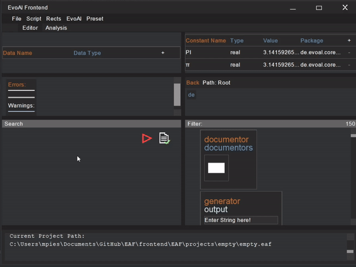
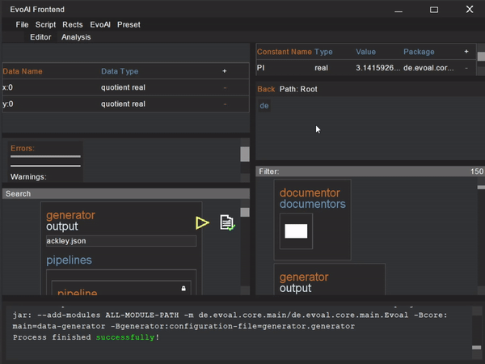

# EvoAl Frontend - EAF

---

This project is designed to create a frontend for [EvoAl](https://evoal.de/) that is accessible to users without any programming knowledge. It aims to simplify the creation of configuration files using simple drag and drop operations with rectangles. Below you will find a detailed table of contents and key features.


---
<div align="center">
  <h2><a href="https://github.com/Max039/EAF/releases/latest">Download</a></h2>
</div>


## Table of Contents
1. [Installation](#installation)
2. [Project](#usage)
	- [Examples](https://github.com/Max039/EAF/tree/main/examples)
3. [Guides](#guides)
   - [Create new from preset](#create-new-from-preset)
   - [Drag and drop rectangle](#drag-and-drop-rectangle)
   - [Add rectangle per rightclick](#add-rectangle-per-rightclick)
   - [Add array element (hold shift)](#add-array-element-hold-shift)
   - [Add data](#add-data)
   - [Add constant](#add-constant)
   - [Run machine learning](#run-machine-learning)
   - [Run generator](#run-generator)
   - [Run evolutionary algorithm with pre run generator](#run-evolutionary-algorithm-with-pre-run-generator)
   - [Error](#error)
   - [Class info](#class-info)
   - [Search definitions](#search-definitions)
   - [Config generation](#config-generation)
4. [Shortcuts](github/md/shortcuts.md)
5. [EvoAl Version Management](github/md/versions.md)
6. [EvoAl Plugins](github/md/plugins.md)
7. [Start Anywhere](github/md/start.md)
8. [Presets](github/md/presets.md)
9. [Pre Run Generator Setup](github/md/prerun.md)
10. [Console Commands](github/md/commands.md)
11. [About](github/md/about.md)

---


## Guides

### Create new from preset


### Drag and drop rectangle


### Add rectangle per rightclick


### Add array element (hold shift)


### Add data


### Add constant


### Run machine learning


### Run generator


### Run evolutionary algorithm with pre run generator


### Error


### Class info


### Search definitions


### Config generation


---

# Installation

## Windows Installation

**!!! Note that currently neither the path of the Eaf installation nor the path to a .eaf file can contain spaces (' ') or sepcial characters !!!**

1. **Download and Install JDK (Java 17)**  
   Download JDK 17 from the [official Oracle website](https://www.oracle.com/java/technologies/javase/jdk17-archive-downloads.html).

   - Set up environment variables:
     - Go to `Environment Variables` → `System Variables` → `Path` → Edit → New
     - Add: `"YOUR_PATH_TO_JAVA_JDK17/bin"`
   
     - Add a new system variable:
       - `JAVA_HOME` → `"YOUR_PATH_TO_JAVA_JDK17"`

2. **Install Maven**  
   - Download Maven from the [official website](https://maven.apache.org/download.cgi) and move it to a preferred location.
   
   - Set up environment variables:
     - Go to `Environment Variables` → `System Variables` → `Path` → Edit → New
     - Add: `"YOUR_PATH_TO_MAVEN/bin"`
     
     - Add a new system variable:
       - `MAVEN_HOME` → `"YOUR_PATH_TO_MAVEN"`

   - (If running via IntelliJ, restart the IDE after setting up Maven.)

3. **Install Git**  
   Ensure Git is installed at the default location: `C:/Program Files/Git`.  
   You can verify by checking the path to the Git bash executable:  
   `C:/Program Files/Git/bin/bash.exe`.

4. **(Optional) Install IntelliJ IDEA for plugin auto open**  
   Install IntelliJ IDEA from [JetBrains](https://www.jetbrains.com/idea/download/) and ensure it's installed in the default location:  
   `C:\Program Files\JetBrains`.

4. **Download the EvoAl Frontend**  
	Download the EvoAl Frontend eaf-setup.exe from the [latest release](https://github.com/Max039/EAF/releases/latest).

5. **Install the EvoAl Frontend**  
	Run the install eaf-setup.exe.

---


## Mac Installation
**!!! If you are reinstalling copy your /projects and /plugins folder before deleting /Documents/Eaf/ to ensure a clean install !!!**

1. **Download and Install JDK (Java 17)**  
   Download JDK 17 from the [official Oracle website](https://www.oracle.com/java/technologies/javase/jdk17-archive-downloads.html) or using a package manager like Homebrew.

2. **Install Maven**  
   - Download Maven from the [official website](https://maven.apache.org/download.cgi) and move it to a preferred location.
   
   - Update your shell environment:
     ```bash
     vi ~/.zshenv
     ```
	 - Start editing:
		- Press `i` to start editing.
   
   - Add the following lines to the file:
     ```bash
     export M2_HOME="PATH_TO_YOUR_MAVEN"
     export PATH=$PATH:$M2_HOME/bin
     ```
   
   - Save and exit the file:
     - Press `Esc` to stop editing.
     - Type `:w` and press `Enter` to save.
     - Type `:q` and press `Enter` to quit.

3. **(Optional) Install IntelliJ IDEA for plugin auto open**  
   Download and install IntelliJ IDEA from [JetBrains](https://www.jetbrains.com/idea/download/).

4. **Download the EvoAl Frontend**  
   Download the EvoAl Frontend Eaf-Installer.dmg from the [latest release](https://github.com/Max039/EAF/releases/latest).

5. **Install the EvoAl Frontend**  
   Open the dmg and move the Eaf.app into your application folder. Afterwards detach the dmg installer.

---