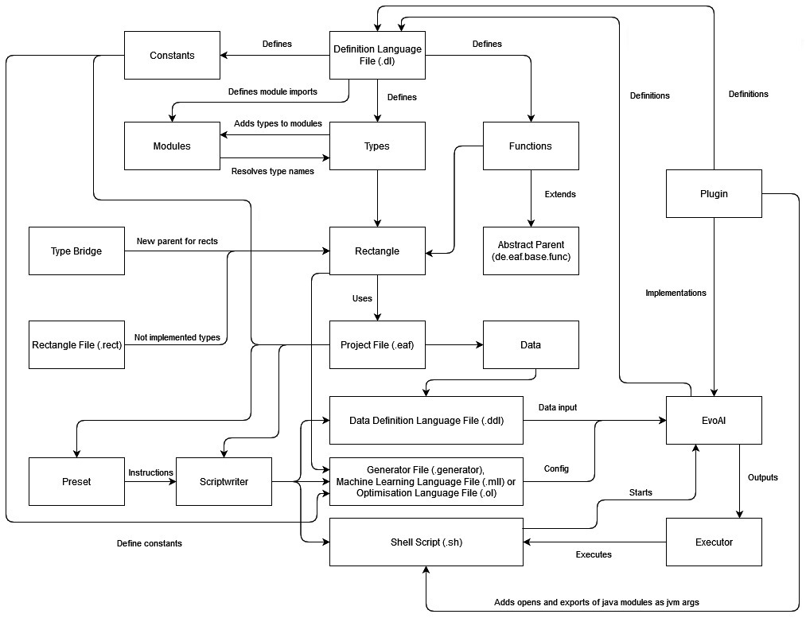

# EvoAl Frontend (EAF) Automated File Generation Process

## 1. **Initialization and Definition Parsing**
The EAF begins by reading all definitions from the active EvoAl build and the plugins located inside the plugins folder. During this phase, it performs the following actions:
- **Class Type Registration**: All types are collected in a class registry under their full domain name. If a type does not extend a base class, it is saved in a secondary base class registry.
- **Module Instance Creation**: A `Module` instance is created to track the defined types within the module. Simple names are resolved using each module’s import statements.
- **Registering Constants and Functions**: Constants and functions are recorded in a representative register alongside types.

## 2. **Function Representation and Bridge Creation**
- For each non-abstract type and function, a rectangular representation is created. Functions are given a parent type, usually named `de.eaf.base.func`.
- **Special Case: Bridges**: "Bridges" are created for special needs. These are abstract classes that force themselves to be the parent of specific classes. This structure is essential for scenarios like generating files where a "component" can be multiple classes branching from multiple "base" classes.
  
## 3. **External Rectangle Loading**
- `.rect` files are loaded to create extra rectangular objects. These rectangles may not be present in the EvoAl build but are needed for the presets.
  
## 4. **Preset Configuration and Project File Creation**
- The configuration defines the active preset, the rectangles to be chosen, constants to be added, and data definitions. This information is stored inside the project file, which ends with a `.eaf` extension.
- The `.eaf` file is the sole required file for importing a project.

## 5. **Script Preparation and Error Checking**
- Before execution, the program checks for any errors in the project. If no errors are present, the Script Writer:
  1. Verifies all plugins for changes or missing files compared to the active EvoAl build.
  2. If a plugin is outdated or missing, it is recompiled using `mvn` and copied into the plugins folder of the build.

## 6. **Config File Generation**
- The Script Writer follows instructions from the preset to convert the rectangle definitions into `.generator`, `.mll`, or `.ol` files.
- **Module Imports**: Imports are automatically generated based on the required module packages.
- **Constant Definitions**: Project-specific constants are added during this phase.
  
## 7. **DDL and Shell Script Creation**
- A DDL (Data Definition Language) file is created with the defined data.
- A Shell script is generated to manage the modules and export them as plugins, ensuring accessibility during runtime.
- The final line of the shell script determines which EvoAl `.sh` script is executed, as defined by the preset.

## 8. **Execution**
- After the `.generator`, DDL, and Shell scripts are created, the Executor runs the Shell script and mirrors the output of EvoAl for execution feedback.

