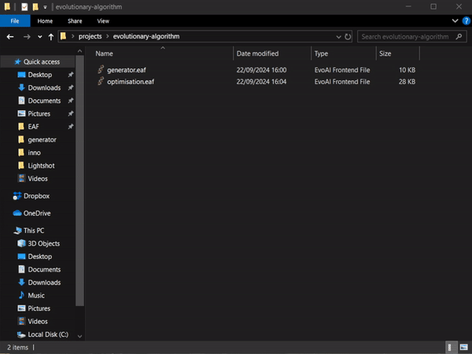

Using a pre-run generator is relatively straightforward. When the EAF detects a file named `generator.eaf` in the same folder as the current project, it will execute this file before launching the current EAF.

### Example:
