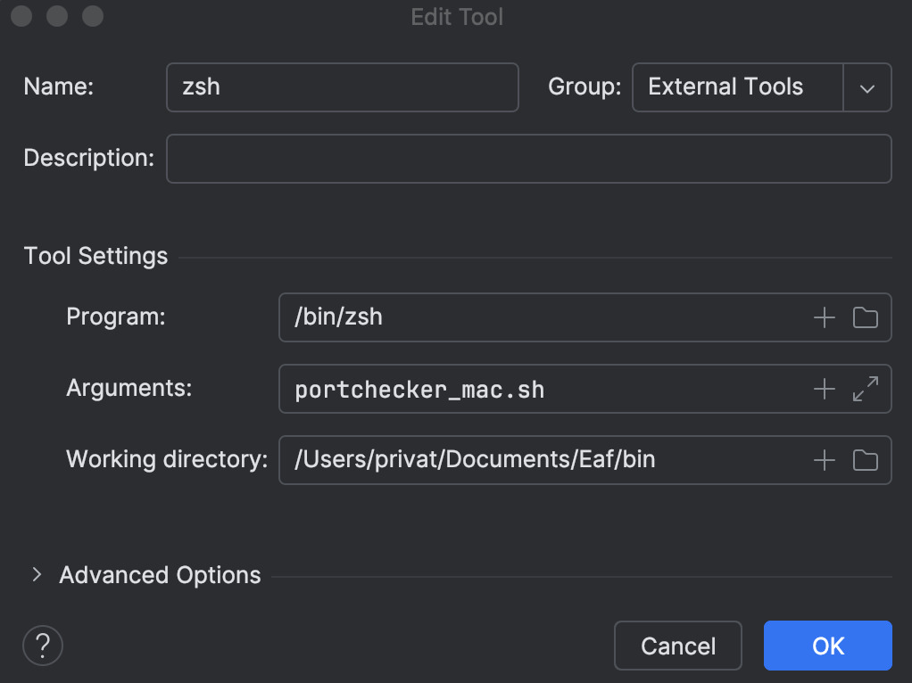

### 1. In Intellij setup a shell script run configuration:

### 2. Setup a remote JVM debug run configuration:

### 3. Setup a external tool for before launch: 
## Windows

## Mac

### 4. Setup a compound run configuration:

### 5. Run the compound run configuration.

