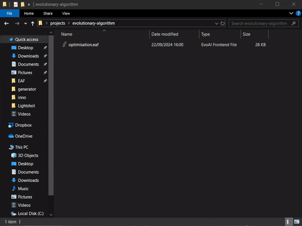
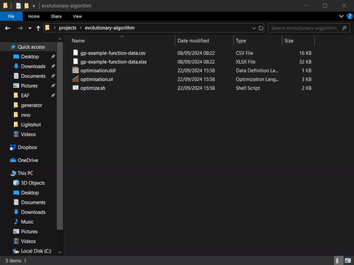
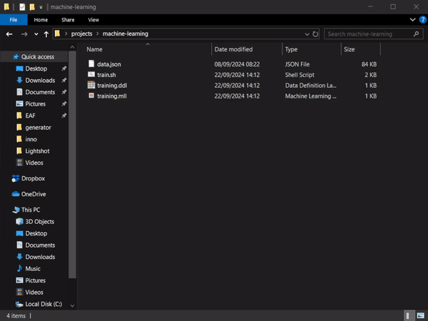
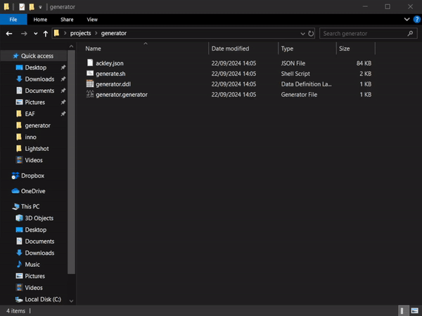

# Starting EAf

EAf can be initiated from any location using a double-click (Windows only) or via the terminal, allowing it to operate within the specified directory.

To maintain your projects within the designated projects folder, utilize the `-import` option in the terminal, or alternatively, launch EAF and select the "Import" option under the "File" menu.

## File Types

### Double-click EAf file

### Double-click OL file

### Double-click MLL file

### Double-click Generator file

